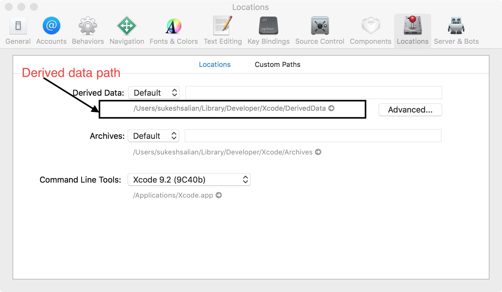

If you are an macOS / iOS / watchOS / tvOS developer you would already know that most of the build issues occur due to the derived data and deleting derived data fixes most of the weird build issues. So today I decided to write down some code which can be used to delete the derived data folder automatically on every reboot or based on demand from the terminal.

###### Note:
* Deleting derived data adds to the build time compared to the usual incremental builds.

* You can find the path to Derived Data folder in XCODE under preferences as shown below.

 


### Delete Derived data on machine startup
To delete the derived data on every time you start your mac we can add a cron job as below:

* Open terminal and type ``` crontab -e ``` this will open the crontab editor.
* Enter ``` @reboot rm -rf <path_to_Derived_data_folder> ``` in the file and save the file.

Now on every reboot your derived data will be deleted. Instead of cron you can also use launchd as mentioned [here.](https://developer.apple.com/library/content/documentation/MacOSX/Conceptual/BPSystemStartup/Chapters/CreatingLaunchdJobs.html)


### On demand script
If you want to delete the derived data based on demand using terminal you can add the below code to end of your bash profile file (i.e ~/.bash_profile) : 

```
cleandd() {
 rm -rf <path_to_Derived_data_folder> 
}

```
After saving the bash profile execute its content once using the below command:

```
source ~/.bash_profile
```

From now on you can delete the derived data just by typing ```cleandd``` in terminal based on your need.


I hope this helps  :-) 
